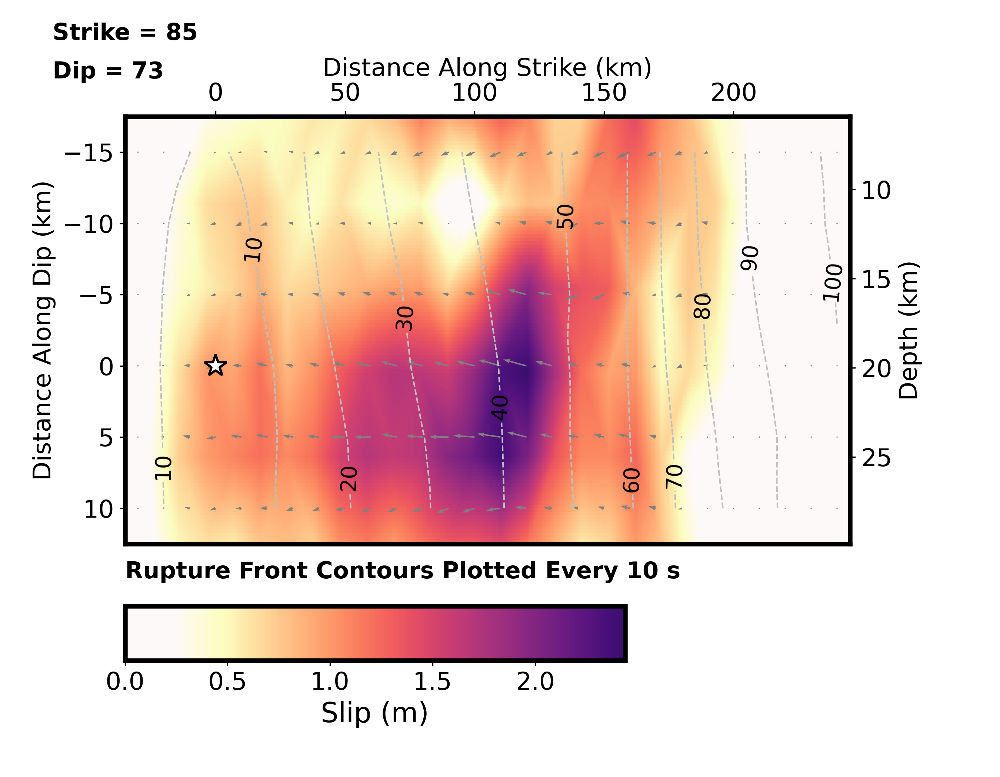
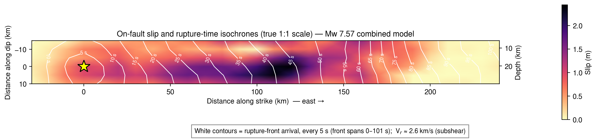
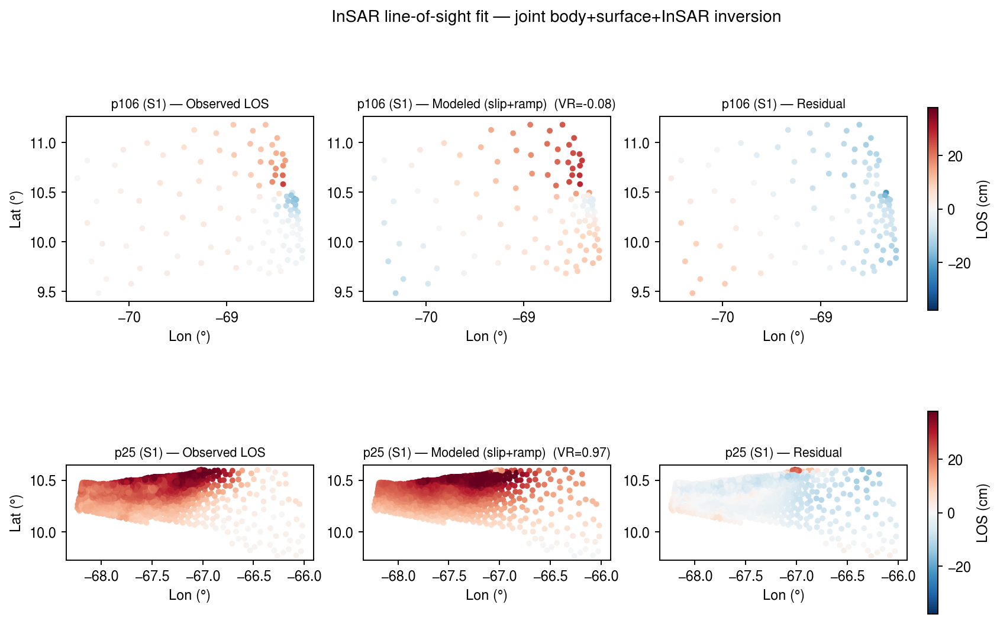
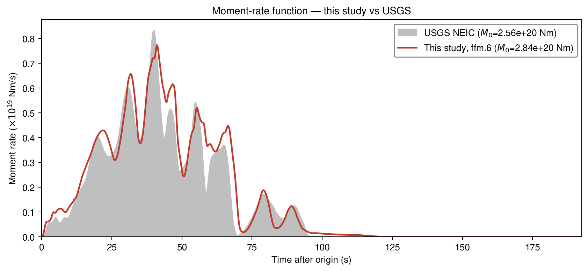

# 2026 Venezuela M7.5 doublet — finite-fault rupture model (teleseismic + InSAR)

Finite-fault rupture model of the **24 June 2026 northern-Venezuela strike-slip doublet**
(Mw 7.2 foreshock + Mw 7.5 mainshock, 39 s apart; San Sebastián fault), from **teleseismic body +
surface waves** and, in the joint model, **Sentinel-1 InSAR**, with a side-by-side comparison to the
published **USGS NEIC** model.

> **Status: preliminary.** Independent rupture-imaging results, shared for transparency and
> reproducibility. Part of a larger study of the sequence's anomalous aftershock-magnitude deficit;
> the aftershock/afterslip analysis is ongoing.

## Headline result

| Quantity | This study | USGS NEIC |
|---|---|---|
| Mw | 7.57 | 7.54 |
| Mechanism | E–W right-lateral strike-slip (strike 86°, dip 74°, rake −176°) | strike 80°/86°, dip 75°, rake −175° |
| Directivity | unilateral **eastward** toward Caracas (up-dip) | unilateral eastward |
| Peak slip | ~2.4–2.8 m | ~2.5 m |
| Rupture duration | ~95–100 s | >90 s |
| Avg. rupture velocity | ~2.7 km/s (subshear) | 2.32 km/s |
| Data | teleseismic body (59) + surface (61) [+ InSAR, joint] | teleseismic body (58) + surface (63) |

Our teleseismic model and the USGS model yield **nearly identical moment-rate functions** (dominant
pulse at ~40 s) and the **same main-slip location** (~70–120 km east of the hypocentre, offshore
toward Caracas). Adding InSAR (a constraint **neither the USGS FFM nor our earlier models used**)
keeps Mw 7.57 and the moment-rate function, but **refines the slip** — pulling the coastal slip
~2 km deeper and reducing shallow slip the teleseismic data alone over-estimated.

## Representative figures — joint teleseismic + InSAR model (ffm.6)

**Coseismic slip distribution** — unilateral eastward rupture, peak slip shallow and ~30–120 km east of the hypocentre (star), offshore toward Caracas:



**On-fault slip with rupture-front isochrones** (true 1:1 scale; white contours every 5 s; front to ~95 s, subshear):



**InSAR line-of-sight fit** — observed, modeled (slip + orbital ramp), and residual for the two Sentinel-1 tracks (variance reduction ≈ 0.97 for the large descending scene). Red = motion away from the satellite, blue = toward:



**Moment-rate function vs USGS** — an independent cross-check (both peak at ~40 s, ~95 s duration, Mw ≈ 7.5–7.57):



*(Full waveform-fit panels — P, SH, Rayleigh, Love — the rise-time map, and the seismic-only vs joint comparison are in [notebook 10](notebooks/10_joint_insar_ffm6.ipynb) and [notebook 11](notebooks/11_seismic_vs_joint_insar.ipynb).)*

## Method

The inversion uses **WISP** (`neic-finitefault`; Ji, Koch & Goldberg — the USGS NEIC method), a
wavelet-domain simulated-annealing kinematic finite-fault inversion, with `fk` Green's functions on a
**LITHO1.0** 1-D velocity model sampled at the epicentre. The doublet is modelled as one extended
rupture referenced to the foreshock origin (single combined-moment CMT). The InSAR joint inversion
uses WISP's imagery (`-t im`) data type with static line-of-sight Green's functions and a per-scene
orbital ramp.

## Model progression (each run isolates one change)

| Run | Notebook | Change |
|---|---|---|
| **ffm.4** | 07 | Base combined teleseismic model (43 s rupture-time cap fixed; 3 nodal Rayleigh excluded) |
| — | 08 | Comparison of ffm.4 with the USGS NEIC model |
| **ffm.5** | 09 | Longer teleseismic body window (70 → 100 s, matching USGS) — tightens rupture duration |
| **ffm.6** | 10 | **Joint** inversion: adds Sentinel-1 InSAR (2 tracks, 2629 LOS points) |
| — | 11 | Seismic-only (ffm.5) vs joint-InSAR (ffm.6) comparison **+ an InSAR primer for non-experts** |
| **ffm.7** | 12 | Body-wave **frequency-band** experiment (long-period body): effect on P/SH fits vs resolution |

**Background reading:** see [`REFERENCES.md`](REFERENCES.md) for an annotated reading list on the
WISP wavelet-domain finite-fault inversion strategy.

## What is and isn't in this repository

- **Included:** the analysis notebooks (with embedded figures), the plotting/comparison scripts, the
  **WISP solution outputs** needed to regenerate every figure, the USGS reference products, and the
  USGS-distributed Sentinel-1 resampled interferograms (public domain).
- **Not included:** the WISP source code itself, and the raw/processed seismic waveforms. To re-run
  the *inversion* (not just the figures) you must install WISP separately and download the data —
  see [Reproducing the inversion](#reproducing-the-inversion).

```
notebooks/
  07_wisp_venezuela_combined_corrected.ipynb   # base FFM: solution, isochrones, rise time, waveform fits
  08_compare_usgs.ipynb                        # comparison with the USGS NEIC model
  09_longwindow_ffm5.ipynb                     # longer body window; window-length effect on duration
  10_joint_insar_ffm6.ipynb                    # JOINT teleseismic + InSAR inversion (all phases + InSAR fit)
  11_seismic_vs_joint_insar.ipynb              # seismic-only vs joint comparison + InSAR primer
  12_bodywave_frequency_band.ipynb             # body-wave frequency band: P/SH fit vs resolution
scripts/
  fig_fault_isochrone.py        # true-1:1-scale slip + rupture-front isochrones; rise-time map
  fig_insar.py                  # InSAR observed/modeled/residual LOS maps
  fig_station_geometry.py       # azimuth–distance station coverage by phase
  fig_station_map_global.py     # global station map (PyGMT)
  usgs_compare.py               # moment-rate / slip comparison vs USGS
  imgutil.py                    # trims whitespace from WISP's native waveform panels
  build_nb07.py ... build_nb11.py  # regenerate each notebook from the scripts + results
results/
  ffm.4/  ffm.5/  ffm.6/  NP1.big/   # WISP solution outputs (Solution.txt, STF.txt, imagery_*, plots/, ...)
  ffm.3/NP1.big/Solution.txt         # earlier run (robustness check in nb07)
data/usgs/         # USGS products: complete_inversion.fsp, moment_rate.mr, CMTSOLUTION, FFM.geojson,
                   #                 resampled_interferograms.zip (Sentinel-1 InSAR)
reproduce_inversion/   # scripts that drive WISP to produce each run (require WISP; env-var paths)
```

## Viewing

Open the notebooks directly (GitHub renders them, figures included), or locally:

```bash
jupyter lab notebooks/07_wisp_venezuela_combined_corrected.ipynb
```

## Regenerating the figures (no WISP needed)

The figures are produced from the included WISP solution outputs, so they regenerate without WISP:

```bash
conda env create -f environment.yml   # or: pip install numpy pandas matplotlib pillow pygmt obspy
conda activate venezuela2026-ffm
cd scripts && for n in 07 08 09 10 11; do python build_nb$n.py; done   # rebuild notebook JSON
cd ../notebooks && jupyter nbconvert --to notebook --execute --inplace *.ipynb
```

Notebooks resolve paths relative to the repository root (run them from `notebooks/`).

## Reproducing the inversion

The inversion itself requires **WISP** (not included):

1. Install `neic-finitefault` (WISP): https://github.com/usgs/neic-finitefault
2. Acquire teleseismic data (IRIS/GEOFON networks II, G, IU, GE; 30°–90°) and responses.
3. The scripts in `reproduce_inversion/` show how each run was produced from a base WISP run (set
   `WISP_HOME`, `FFM_RUN_ROOT`, `USGS_DIR`):
   - `rerun_ffm_longdur.py` — set the maximum source duration so the rupture front isn't truncated
   - `rerun_ffm_exclude_rayleigh.py` — down-weight three nodal/misfitting Rayleigh stations
   - `rerun_ffm_longwindow.py` — re-cut a 100 s teleseismic body window (ffm.5)
   - `rerun_ffm_insar_joint.py` — add the Sentinel-1 InSAR and invert jointly (ffm.6)

   See the notebook methods sections for the full parameterization.

## Data and software credits

- **WISP / `neic-finitefault`** — Ji, C., D. J. Wald, & D. V. Helmberger; USGS NEIC implementation
  (Koch, Goldberg et al.). Please cite WISP if you use this workflow.
- **USGS NEIC** finite-fault product for event `us6000t7zp` (files in `data/usgs/`).
- **Teleseismic waveforms** — IRIS/EarthScope and GEOFON FDSN data centres.
- Velocity model: **LITHO1.0** (Pasyanos et al., 2014).

## License

Code: MIT (see `LICENSE`). Figures and derived results: CC-BY-4.0. USGS products in `data/usgs/` are
U.S. Government public-domain works.
